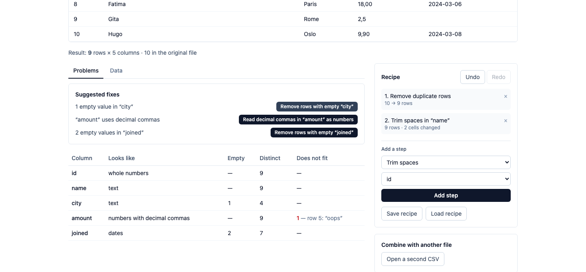

# csv-clinic

Open a messy CSV, see what is wrong with it, fix it with a recipe, and download a clean file with a report of every change. Everything runs in the browser — the file is never uploaded.

**[Try it live](https://mrnednick.github.io/csv-clinic/)** — press **Try a messy sample file** and go from a broken CSV to a clean download in a minute. The first open fetches the DuckDB engine (about 8 MB compressed) from the same site.



## What it does

- **Import** — the delimiter (comma, semicolon, tab) and header are detected; a UTF-8 BOM is dropped; quoted fields keep their commas. A row with the wrong number of columns is named, not silently padded.
- **Problems** — every column gets a profile: what its values look like (whole numbers, numbers, numbers with decimal commas, dates, yes/no, text), how many are empty or padded with spaces, how many distinct, and which values do not fit, with the row they are on. Duplicate rows are counted. Each finding comes with a one-click fix.
- **Recipe** — trim spaces, fill or drop empty values, remove duplicate rows, read decimal commas, convert to numbers or dates, rename or remove columns. Every step shows what it did: rows before → after, cells changed, and values that could not be converted. Undo, redo and removing any step recompute the result from the untouched original. A recipe can be saved as JSON and replayed on next month's file.
- **Combine** — open a second CSV and add its columns by a key, keeping every row or only matching ones. When a key repeats in the other file and multiplies rows, the recipe says so.
- **Download** — a clean CSV with the separator you choose (semicolon for Excel in much of Europe), and a Markdown change report. Cells that start with `=`, `+`, `-` or `@` get a leading apostrophe, so a spreadsheet shows them as text instead of running them as a formula; plain numbers like `-3.0` are left alone.
- **Cancel** — a long load or step can be stopped; the last good result comes back.

The recipe and any second file are kept in the browser per file name, so a reload picks up where you were.

## How it is built

| Layer | What lives there |
|---|---|
| `src/domain` | Pure TypeScript: dialect detection and parsing, the profile queries and type guessing, recipe steps and their SQL, CSV export with the formula guard, the change report |
| `src/application/workbench.ts` | The use cases over an `Engine` interface: load sources, run a recipe step by step, read the preview, profile and export |
| `src/adapters/duckdb-browser.ts` | [DuckDB-Wasm](https://duckdb.org/docs/api/wasm/overview) in its own Web Worker — the worker owns the database, the page only sends SQL; loaded on the first file, not with the page |
| `src/features` | React: import, the workbench tabs, recipe, combine and download panels |

**Why DuckDB-Wasm.** Profiling a column means a dozen aggregate questions over every value; a recipe is a chain of relational steps; a join is a join. SQL expresses all of that directly, and DuckDB answers it on hundreds of thousands of rows in a second or two — in a worker, so the page never freezes.

**The original is never changed.** A file is loaded once as a table of text; each recipe step is a `SELECT` over the previous step's result, materialised as its own table. Undo is simply the recipe without its last step, recomputed from the source, and the row counts and changed-cell counts per step fall out of comparing neighbouring tables by the original line number that every row carries.

A few things that are easy to get wrong:

- DuckDB reads `'37.7'` as the integer 38 when cast, so "whole numbers" are recognised by pattern, and converting to whole numbers leaves a decimal empty (and counted) instead of rounding it.
- After a join, row ids are renumbered, so a key that repeats on the other side cannot make the change counts lie.
- Cancelling terminates the database worker — the only way to stop a query already running in it — and the last committed recipe is replayed onto a fresh one.

## Measured

On a MacBook, Chromium: a 9.6 MB file with 300,000 rows loads and profiles in about 3.4 s, and one recipe step over it takes about 2.8 s. Browser storage keeps a file for reload only while it fits in `localStorage` (a few MB); a larger one works fine but has to be reopened after a reload.

## Run it

Node `^22.12.0` or newer (Vitest 5 needs it).

```bash
npm install
npm run dev
npm test          # unit tests plus integration tests on real DuckDB-Wasm under Node
npm run lint && npm run typecheck && npm run build
```

The integration tests (`test/integration/workbench.test.ts`) run the same SQL the browser runs, on DuckDB-Wasm's Node build: a semicolon file with a BOM and quoted commas, the profile of a deliberately messy customer list, each cleaning step's counts, undo, a step that no longer fits, a join that multiplies rows, the export's formula guard and report, and a 200,000-row file.

A static build (`GITHUB_PAGES=true npm run build` for a `/csv-clinic/` subpath) is the whole app; there is no server.
